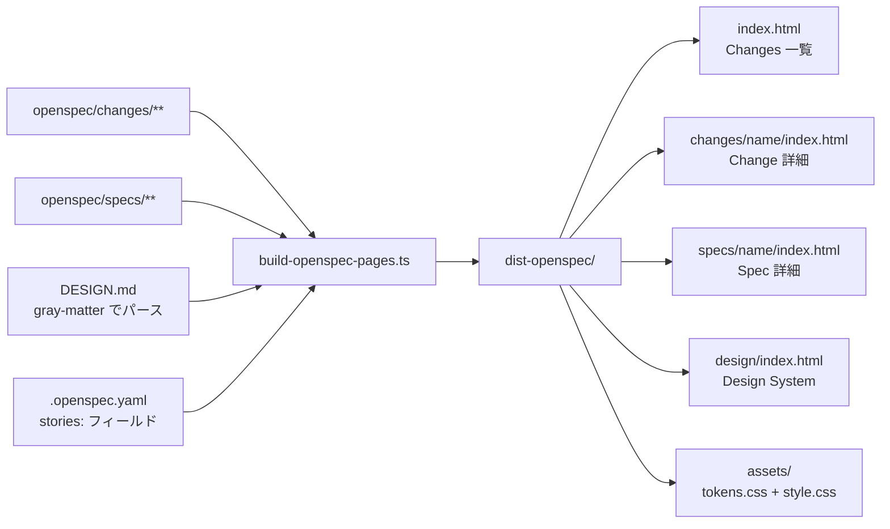

## Context

`scripts/build-openspec-pages.ts` は現在 `marked` で Markdown を HTML に変換し、インラインスタイルの最小テンプレートで出力する（約200行）。`DESIGN.md` の参照・Mermaid 変換・Storybook embed の仕組みは存在しない。デプロイは `peaceiris/actions-gh-pages@v4` で `gh-pages` ブランチへ push しているが CNAME 設定がない。

## Goals / Non-Goals

**Goals:**
- `build-openspec-pages.ts` を全面刷新し、ポータル構造（Changes 一覧・Change 詳細・Spec 詳細・Design System）の HTML を生成する
- `DESIGN.md` から Design System セクションを自動生成する
- `design.md` 内の Mermaid ブロックをブラウザ側でレンダリングする
- `.openspec.yaml` の `stories:` フィールドから Storybook embed を生成する
- `specs.asunaroblog.net` カスタムドメインを設定する

**Non-Goals:**
- 本番ブログサイト（asunaroblog.net）のコードへの変更
- Storybook 本体（`storybook.asunaroblog.net`）のコードへの変更
- インタラクティブな検索・全文検索機能の実装

## Decisions

### 1. ビルドスクリプトのファイル構成

**決定**: `build-openspec-pages.ts` 単一ファイルを維持しつつ、内部を役割別の関数グループに整理する。

**理由**: 現在も単一ファイルで機能している。モジュール分割はスクリプト実行時の import パス解決が Bun の `import.meta.dir` に依存するため複雑になる。将来的に500行を超えたら分割を検討する。

**代替案**: `lib/design-system.ts`, `lib/mermaid.ts` 等に分割 → import パス管理が増えコストが上がる。

---

### 2. Mermaid レンダリング方式

**決定**: クライアントサイドレンダリング（CDN 経由）を採用する。

```
ビルド時: ```mermaid ... ``` → <pre class="mermaid">...</pre> に変換
ブラウザ: mermaid.js (CDN) が自動検出して SVG にレンダリング
```

**理由**: サーバーサイドレンダリングは headless ブラウザか仮想 DOM が必要で Bun 環境での動作保証が難しい。このサイトはすでに JS（フィルタ・iframe）を使っており、CDN 追加は一貫している。

**代替案**: サーバーサイド（`@mermaid-js/mermaid-js`）→ 新規依存追加・Bun での動作検証コストが高い。

---

### 3. DESIGN.md のパース

**決定**: 既存依存の `gray-matter` でフロントマター（YAML）を解析し、本文（Markdown）は `marked` で HTML 変換する。

**理由**: `gray-matter` はすでに `package.json` に存在する。DESIGN.md のフロントマターには `colors`, `typography`, `spacing`, `rounded`, `components` オブジェクトが定義されており、そのまま Design System ページの各セクション生成に使える。

**代替案**: 正規表現で YAML を手動パース → gray-matter のほうが安全で保守しやすい。

---

### 4. 出力ディレクトリ構造

**決定**: 以下の構造で生成する。

```
dist-openspec/
├── index.html                      ← Changes 一覧（ステータスフィルタ付き）
├── changes/<name>/index.html       ← Change 詳細（proposal + design + tasks を1ページに統合）
├── specs/<name>/index.html         ← Spec 詳細（Requirement/Scenario ブロック）
├── design/index.html               ← Design System（DESIGN.md から生成）
└── assets/
    ├── tokens.css                  ← CSS 変数定義
    └── style.css                   ← サイトスタイル
```

**理由**: 現行の `.html` 拡張子付き URL（`proposal.html`, `spec.html`）から `index.html` ベースの URL（`changes/<name>/`, `specs/<name>/`）に変更する。GitHub Pages では `index.html` が自動解決されるため URL がクリーンになる。

**代替案**: 現行の URL 構造を維持 → 拡張子が露出し、後からクリーンにしにくい。

---

### 5. CSS の配信方式

**決定**: `assets/tokens.css` + `assets/style.css` を `dist-openspec/assets/` にコピーし、各 HTML から相対パスで参照する。

**理由**: テンプレートに CSS をインライン埋め込みすると各ページに数 KB の重複が生じる。外部ファイルにするとブラウザキャッシュが効き、スタイル変更時に HTML の再生成が不要になる。

**代替案**: インライン `<style>` → HTML サイズが増加し保守しにくい。

---

### 6. レイアウト案の選択

デザインファイルに提示された3案（A: サイドバー型・B: トップナビ + 2カラム・C: ランディング）のうち、**案 B を採用することを推奨する**。

**理由**: 現状（4 Changes・28 Specs）のスケールに最適で、エンジニアと PdM の両方に対応できる。Spec ページの「左 ToC + 右本文」2カラムは長文仕様の読みやすさが最も高い。

**代替案**:
- 案 A（サイドバー）→ Changes が 30 件を超えたとき有利だが現状は情報密度が高すぎる
- 案 C（ランディング）→ PdM への説明には向くが、日常的な参照ユースケースでは縦に長くなりすぎる

---

### 7. Storybook embed の URL 生成

**決定**: `.openspec.yaml` の `stories:` フィールドに列挙されたストーリー ID を以下の URL フォーマットで embed する。

```
https://storybook.asunaroblog.net/iframe.html?id=<story-id>&viewMode=story
```

`stories:` フィールドがない・空の場合は embed セクション自体を生成しない。

**理由**: `storybook.asunaroblog.net` はすでに Cloudflare Pages にデプロイ済みで外部アクセス可能。`/iframe.html` エンドポイントは Storybook の標準 embed URL。

---

## ビルドパイプライン



## Risks / Trade-offs

- **既存 URL の破壊**: 現行の `proposal.html` / `spec.html` 形式の URL が `changes/<name>/` / `specs/<name>/` に変わる。外部からのリンクが存在する場合は 404 になる。→ 現時点で外部リンクは確認されていないため許容する
- **Mermaid CDN 依存**: オフライン環境や CDN 障害時に図が表示されない。→ ドキュメントサイトの性質上、常時オフライン利用は想定しない
- **スタイル選択（案 B）の確定**: 3案のうち B を選択したが、実装後に変更する場合は CSS の大幅な差し替えが必要。→ 実装前にユーザーに確認する

## Migration Plan

1. `dist-openspec/` は毎回 CI でフルビルドするため、出力構造の変更はデプロイ時に自動反映される
2. `gh-pages` ブランチの旧 URL（`proposal.html` 等）は新ビルドで上書きされ消滅する
3. CNAME ファイルの追加と DNS 設定（外部作業）は実装完了後に行う

## Open Questions

- **レイアウト案の確定**: 案 B を推奨しているが、実装前にユーザーの確認が必要
- **Change 詳細ページのタブ構成**: proposal / design / tasks を1ページに縦スクロールで並べるか、タブで切り替えるか未定（縦スクロールを推奨）
